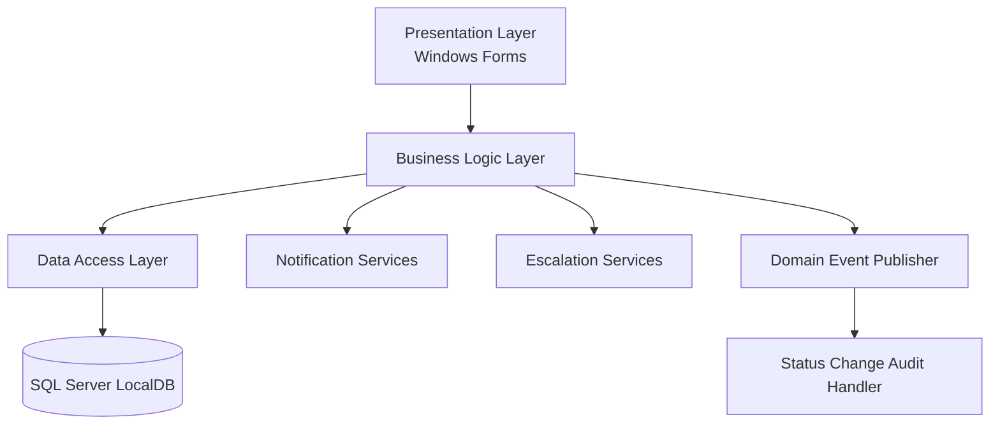

# CivicConnect Architecture

## Architecture Overview

CivicConnect uses a layered application architecture. The logical layers are separated from the physical deployment environment so that technology and hosting decisions remain explicit.

## Logical Architecture

### Presentation Layer

The Presentation project provides the Windows Forms user interface. It handles user interaction, input, request display, filtering and dashboard actions.

### Business Logic Layer

The BusinessLogic project contains application rules and services such as service-request validation, lifecycle transitions, dashboard metrics, notifications, escalation and domain events.

### Data Access Layer

The DataAccess project contains repository interfaces and SQL access. Repository implementations isolate database operations from the UI and business rules.

### Models

The Models project contains domain data objects shared by the application layers.

### Persistence

The current implementation uses SQL Server LocalDB with the database name CityMakerspaceDB.

## Physical Deployment

The current M2 development arrangement is a Windows workstation running the Windows Forms client and local application components, with SQL Server LocalDB on the same development machine.

Production hosting has not been finalised in M2.

## Main Request Flow

Windows Forms → ServiceRequestService → IServiceRequestRepository → ServiceRequestRepository → SQL Server LocalDB

Status changes additionally publish a domain event to the in-process publisher.

## Architecture Drivers

The main M1 drivers affecting this architecture are:

- NFR-001 Access control
- NFR-009 Auditability
- NFR-010 Maintainability

NFR-009 requires lifecycle actions to preserve the actor, timestamp and affected request identifier. NFR-010 requires substantive changes to remain traceable through controlled GitHub work and review.

## Constraints

- The project is being developed by a two-person team.
- The existing codebase already uses .NET 8 and Windows Forms.
- The current database environment is SQL Server LocalDB.
- M1 deferred the technology and architecture decisions to M2.
- The M1 scope excludes external CRM, WhatsApp, email and emergency-dispatch integrations from the baseline.

## Alternatives Considered

### Monolithic implementation

A single project could contain UI, business rules and database code.

This would reduce project structure but weaken separation of responsibilities and make later changes harder to isolate.

### Layered architecture

Presentation, business logic, data access and models remain separated.

This matches the current project structure and gives clear responsibility boundaries without introducing additional deployment infrastructure.

### Distributed services

Business capabilities could be deployed as separate services.

This would introduce network communication, deployment and operational complexity. The current M2 scope does not provide evidence that those additional boundaries are required.

## Decision

CivicConnect will continue with the layered architecture already represented by the solution projects, while adding in-process domain-event handling for lifecycle side effects and keeping external integrations behind adapter interfaces.

The architecture does not introduce a network boundary where an in-process boundary is sufficient.
