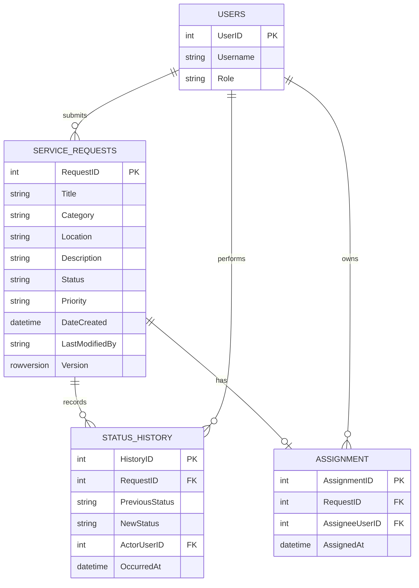

# CivicConnect Data and Persistence Baseline

## Current Schema

The current SQL script defines two tables.

### Users

- UserID primary key
- Username unique and not null
- Password
- Role

### ServiceRequests

- RequestID primary key
- Title
- Category
- Location
- Description
- Status
- Priority
- DateCreated
- LastModifiedBy

The current implementation stores the modifying user in LastModifiedBy as a username string rather than a foreign key.

## Target M2 Data Model

The M2 design should preserve the current request entity while making lifecycle history and assignment data explicit as those capabilities are implemented.

The relationship section above is a target design baseline. The current database script does not yet implement these additional foreign-key relationships or the Version column.

## Persistence Decision

SQL Server remains the persistence technology because the current application already uses SQL Server LocalDB and direct SQL access through Microsoft.Data.SqlClient.

The application should use an application-managed transaction boundary when one request operation must update multiple related records together.

## Unit of Work and Concurrency

For multi-record operations, the M2 design uses a Unit of Work boundary so the request write, lifecycle history write and assignment write can succeed or fail as one transaction.

Optimistic Concurrency Control is proposed using a SQL Server rowversion value on the request record. An update must only succeed when the version read by the application still matches the stored version.

This avoids holding long-lived database locks around application work and gives the service layer an explicit conflict result.

## Integrity and Validation

Validation is layered:

1. UI validation for immediate feedback.
2. Business Logic validation for business rules.
3. Database constraints for final relational integrity.

The current request repository already parameterises its SQL commands.

## SPOF, Scalability and Recovery

LocalDB on a single development workstation is a single point of failure for the local development environment.

Production availability, backup ownership and recovery objectives are not established by the current M2 baseline and remain deployment/readiness decisions.

Scaling beyond the desktop/local database arrangement would require a separate deployment decision.
